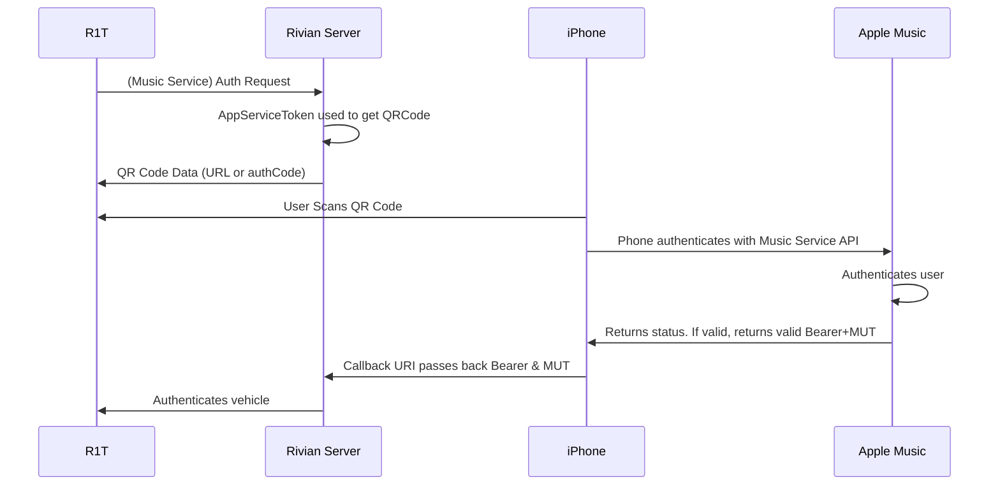
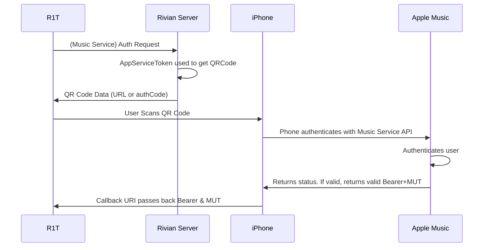
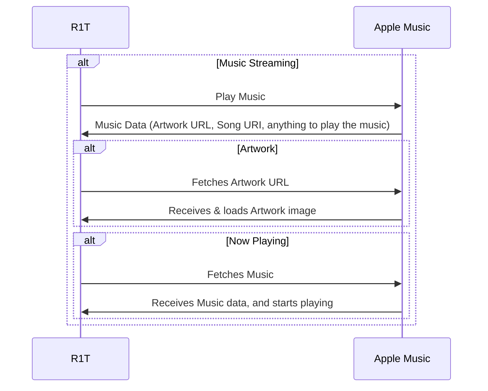
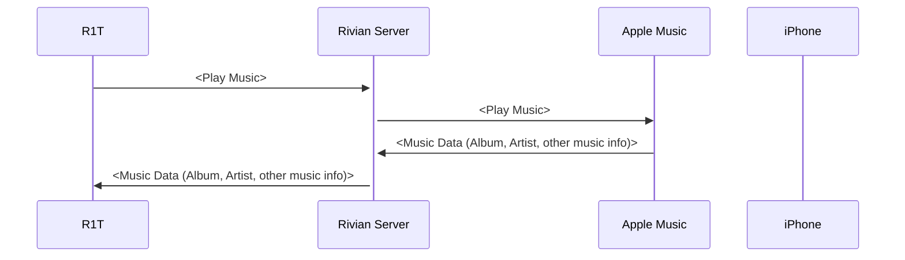

## (Theoretical) Current Music Auth Flow

## (Theoretical Alt.) Current Music Auth Flow

Based on existing experience, the current Music Authentication Flow involves Rivian's server to maintain authentication. As part of that process, the user's access token is exposed to Rivian (and potentially other Third Parties) in order to live stream music on the vehicle potentially creating a Privacy concern if correct.

### Recommended Music Auth Flow (Apple Music cont.)

## (Theoretical) Authenticated

